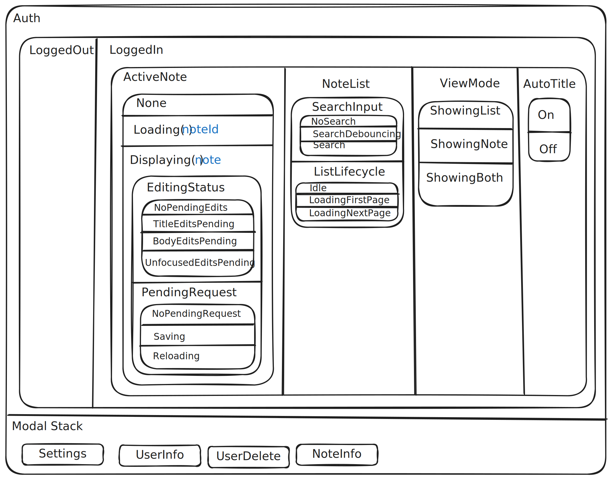

# Application State Model

This document describes the state model for mini-notes, inspired by Harel statecharts.
The application state is organized as **parallel regions**, some of which only exist
within certain parent states. The system is always in exactly one state per active region.

## Notation

- `parallel(A, B, C)` — regions A, B, C are active simultaneously
- `|` separates mutually exclusive states within a region
- States with parenthesized content carry data (e.g., `Loading(noteId)`)
- Indented sub-regions only exist when their parent state is active

## Formal Model

```
App = parallel( Auth, ModalStack )

Auth =
  | LoggedOut
  | LoggedIn( parallel(ActiveNote, NoteList, ViewMode, AutoTitle) )

ActiveNote =
  | None                         -- no note loaded; typing starts a new one
  | Loading( noteId )
  | Displaying( note, parallel(EditingStatus, PendingRequest) )

EditingStatus =
  | NoPendingEdits
  | TitleEditsPending            -- title focused, unsaved title changes
  | BodyEditsPending             -- body focused, unsaved body changes
  | UnfocusedEditsPending        -- undo/redo applied, needs timer save

PendingRequest = NoPendingRequest | Saving | Reloading

NoteList = parallel( SearchInput, ListLifecycle )
SearchInput =
  | NoSearch                     -- showing/loading the full note list
  | SearchDebouncing             -- typing, request not yet sent
  | Search                       -- showing/loading results matching search box
ListLifecycle =
  | Idle
  | LoadingFirstPage
  | LoadingNextPage

ViewMode = ShowingList | ShowingNote | ShowingBoth

AutoTitle = Off | On

ModalStack = [ Modal, ... ]      -- stack; top is visible
Modal = Settings | UserInfo | UserDelete | NoteInfo
```

## Visual Diagram



An attempt to use `state-model.mmd` for a Mermaid stateDiagram-v2 source failed as it could not reliably render it at
https://mermaid.live or elsewhere.

The picture above is hand-drawn and comes from `app-states.excalidraw` and can be rendered using the site https://excalidraw.com/.

## Region Descriptions

### Auth

Top-level region. All other regions except ModalStack only exist when Auth = LoggedIn.

| State | Description |
|---|---|
| LoggedOut | Login page is shown. No note data is loaded. |
| LoggedIn | Main application is active. All sub-regions are initialized. |

### ActiveNote

Tracks which note (if any) the user is working with.

| State | Data | Description |
|---|---|---|
| None | — | No note loaded. The note editing area is empty. Typing in the body or title starts a new note (auto-title is typically active). |
| Loading(noteId) | noteId | A fetch is in flight for the given note. The noteId serves as the async intent token: when the response arrives, it is applied only if ActiveNote is still Loading with the same noteId. |
| Displaying(note) | note object | A note is loaded and visible. Sub-regions EditingStatus and PendingRequest are active. |

### EditingStatus (sub-region of Displaying)

Tracks whether there are unsaved edits and where they originated. Focus is implicit:
TitleEditsPending implies the title field is focused; BodyEditsPending implies the body
field is focused (because blur triggers save, which clears the pending state).

| State | Description |
|---|---|
| NoPendingEdits | The displayed note matches the last-saved version. Focus on a field without typing stays here. |
| TitleEditsPending | The user has typed in the title field. Unsaved changes exist in the title. Resolved by blur (which triggers save). |
| BodyEditsPending | The user has typed in the body field. Unsaved changes exist in the body. Resolved by blur (which triggers save). |
| UnfocusedEditsPending | Undo or redo was applied while no editing field was focused. Unsaved changes exist but no blur event will fire. Resolved by a timer-based autosave (planned). |

### PendingRequest (sub-region of Displaying)

Tracks in-flight API requests related to the current note.

| State | Description |
|---|---|
| NoPendingRequest | No request in flight for this note. |
| Saving | A PUT request is in flight to save edits. |
| Reloading | A GET request is in flight to refresh the note (e.g., after stale-tab detection). |

### SearchInput (sub-region of NoteList)

Tracks the state of the search box.

| State | Description |
|---|---|
| NoSearch | The search box is empty. The note list shows all notes (or is loading all notes). |
| SearchDebouncing | The user has typed in the search box but the debounce timer hasn't fired yet. No search request has been sent. |
| Search | A search has been submitted (or results received). The note list shows (or is loading) results matching the search text. |

### ListLifecycle (sub-region of NoteList)

Tracks the loading state of the note list, whether it's a full list or search results.
This region is orthogonal to SearchInput: the same loading lifecycle applies regardless
of whether we're loading a full list or search results.

| State | Description |
|---|---|
| Idle | The note list is fully loaded (no pending fetch). |
| LoadingFirstPage | The first page of results is being fetched (initial load or new search). |
| LoadingNextPage | A subsequent page is being fetched (infinite scroll pagination). |

### ViewMode

Tracks which panels are visible. On narrow screens (mobile), only one panel is shown
at a time. On wide screens, both panels are visible simultaneously.

| State | Description |
|---|---|
| ShowingList | Only the note list panel is visible (narrow screen). |
| ShowingNote | Only the note editing panel is visible (narrow screen). |
| ShowingBoth | Both panels are visible side by side (wide screen). |

### AutoTitle

Tracks whether typing in the body auto-populates the title from the first line.

| State | Description |
|---|---|
| Off | Title is independent of body content. |
| On | The title field is automatically updated from the first line of the body as the user types. |

### ModalStack

A stack of open modal dialogs. The topmost modal is the one currently visible.
This region is orthogonal to Auth: the Settings modal can be opened from the login page.

| State | Description |
|---|---|
| (empty) | No modal is open. |
| [Modal, ...] | One or more modals are open. Closing the top modal reveals the one beneath it (or the main view if the stack becomes empty). |

Available modals: Settings, UserInfo, UserDelete, NoteInfo.

## Within-Region Transitions

### Auth
```
LoggedOut → LoggedIn       : successful login or account creation
LoggedIn → LoggedOut       : logout, account deletion, or 401 response
```

### ActiveNote
```
None → Loading(noteId)     : user clicks a note slug
None → Displaying(new)     : user types in empty fields (creates new note on save)
Loading(X) → Loading(Y)    : user clicks a different note while X is loading
Loading(X) → Displaying    : fetch for X completes (and ActiveNote is still Loading(X))
Displaying → None          : note deleted, or search started
Displaying → Loading(Y)    : user clicks a different note
```

### EditingStatus
```
NoPendingEdits → TitleEditsPending       : user types in title field
NoPendingEdits → BodyEditsPending        : user types in body field
TitleEditsPending → NoPendingEdits       : title field blur → save completes
BodyEditsPending → NoPendingEdits        : body field blur → save completes
NoPendingEdits → UnfocusedEditsPending   : undo or redo pressed
TitleEditsPending → UnfocusedEditsPending: undo or redo pressed while editing title
BodyEditsPending → UnfocusedEditsPending : undo or redo pressed while editing body
UnfocusedEditsPending → NoPendingEdits   : autosave timer fires → save completes
```

### PendingRequest
```
NoPendingRequest → Saving      : save initiated (blur or timer)
NoPendingRequest → Reloading   : stale-tab refresh or manual reload
Saving → NoPendingRequest      : save response received
Reloading → NoPendingRequest   : reload response received
```

### SearchInput
```
NoSearch → SearchDebouncing    : user types in search box
SearchDebouncing → Search      : debounce timer fires, request sent
SearchDebouncing → NoSearch    : user clears search box
Search → SearchDebouncing      : user types more in search box
Search → NoSearch              : user clears search box
```

### ListLifecycle
```
Idle → LoadingFirstPage        : initial load, search submitted, or search cleared
LoadingFirstPage → Idle        : first page of results received
Idle → LoadingNextPage         : scroll sentinel becomes visible
LoadingNextPage → Idle         : next page of results received
```

### ViewMode
```
ShowingList → ShowingNote      : note selected (narrow screen)
ShowingNote → ShowingList      : back-to-list pressed
(any) → ShowingBoth            : screen becomes wide enough
ShowingBoth → ShowingList      : screen becomes narrow (no note active)
ShowingBoth → ShowingNote      : screen becomes narrow (note is active)
```

### AutoTitle
```
Off → On                       : typing begins in body with ActiveNote = None
On → Off                       : title field focused, existing note selected, or search started
```

## Cross-Region Transitions

These are user actions that cause transitions in multiple regions simultaneously.

| Action | ActiveNote | SearchInput | ListLifecycle | ViewMode | AutoTitle |
|---|---|---|---|---|---|
| **Login** | → None | → NoSearch | → LoadingFirstPage | → ShowingBoth/List | → On |
| **Logout** | → None | → NoSearch | → Idle | → (reset) | → Off |
| **Type in search** | → None | → SearchDebouncing | — | → ShowingList (narrow) | → Off |
| **Clear search** | — | → NoSearch | → LoadingFirstPage | — | — |
| **Click note slug** | → Loading(id) | — | — | → ShowingNote (narrow) | → Off |
| **Delete note** | → None | — | — | → ShowingList (narrow) | — |
| **Back to list** | — | — | — | → ShowingList | → Off |
| **Type in body (no note)** | stays None | — | — | — | → On |

## Derived vs. Stored State

Some states in the model are currently **derived from the DOM** rather than stored as
explicit variables:

- **EditingStatus**: Currently derived at save-time by comparing input field values to
  `currentNote.title`/`currentNote.body`. If a timer-based autosave for unfocused edits
  is added, this would need to become an explicitly tracked variable.

- **Focus** (implicit in EditingStatus): Tracked by the browser via `document.activeElement`.
  The application responds to `focus` and `blur` events rather than querying focus state.

- **ViewMode**: Currently stored as the CSS class `showing-note` on `#main-page`. The
  ShowingBoth state is determined by viewport width via CSS media queries.

Regions with explicit backing variables today:
- **Auth**: `document.body.classList.contains("logged-in")`
- **ActiveNote**: `currentNote`, `intendedCurrentNoteId`
- **SearchInput**: `searchDebounceTimer`, search input element value
- **ListLifecycle**: `isLoadingNotes`, `continuationKey`
- **AutoTitle**: `autoTitleActive`
- **ModalStack**: `shadowBoxDismissCallbacks` Map, shadow-box element display style
